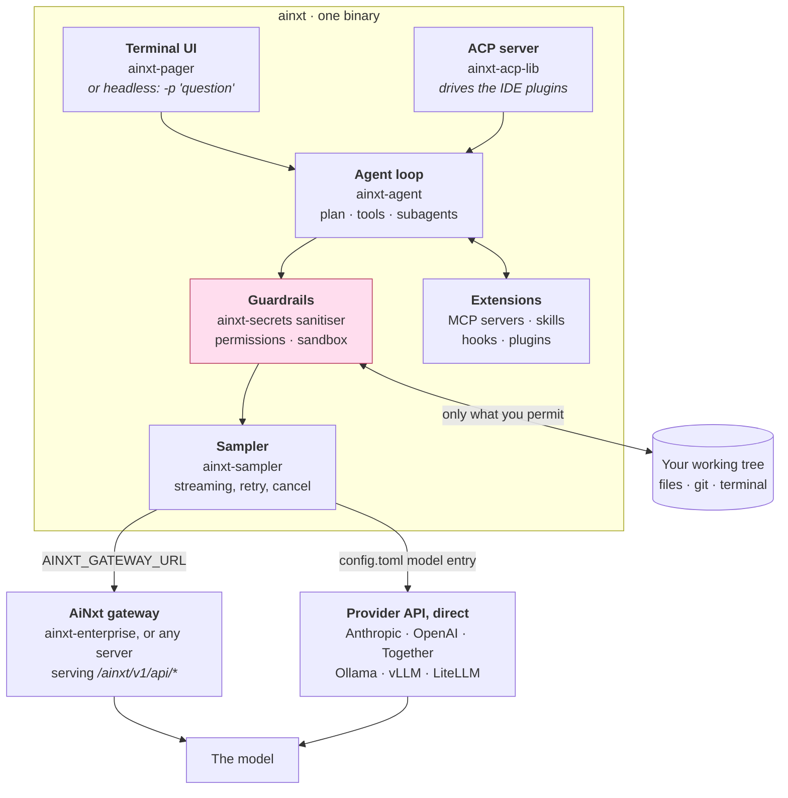
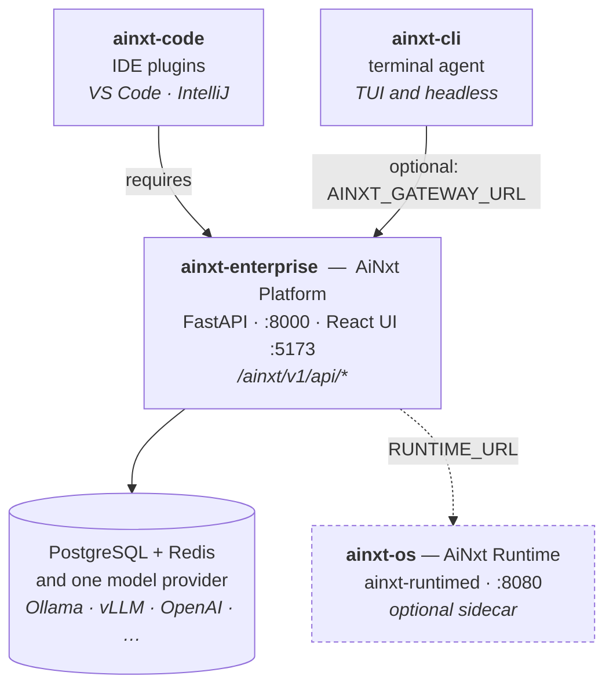

<div align="center">

<!-- Brand-approved lockups from AINxt_logo_icon/. -01 is the transparent version for light
     backgrounds; -02 is the navy-plate version, which stays legible on GitHub's dark theme.
     PNG rather than SVG because GitHub sanitises inline SVG in Markdown. -->
<picture>
  <source media="(prefers-color-scheme: dark)" srcset="AINxt_logo_icon/AINxt_CTC-02.png">
  
</picture>

<h1>AiNxt CLI</h1>

[](OSSMETADATA)


**AiNxt CLI** is a terminal-based AI coding agent — a full-screen TUI that
understands your codebase, edits files, runs shell commands, searches the web,
and manages long-running tasks. It can also run headlessly for scripting and CI.

</div>

---

## What is this repo?

This is the **source code** for the AiNxt CLI binary (`ainxt`). It is a Rust
workspace of ~80 crates that compiles into a single self-contained binary.

> **AiNxt CLI does not bundle any AI models or cloud backend.** Models come from
> somewhere you configure: either an AiNxt gateway you operate, or a provider you
> call directly with your own key — Anthropic, OpenAI, Together, Ollama, vLLM and
> anything OpenAI-compatible. Those are two *different* settings and are not
> interchangeable; [§ Step 2](#step-2--point-it-at-a-gateway) explains which to
> use. Unconfigured, the CLI starts and reports no models.

---

## What it looks like

Headless, one shot. This is a real transcript against a local Ollama model — no
gateway, no account, just a `[model.*]` entry and an API key placeholder:

```console
$ ainxt -m ollama-llama -p "In one sentence, what does a Rust Cargo workspace do?"
A Rust Cargo workspace is a collection of related Rust libraries and executables
that are compiled, built, and published together as a single unit.
```

Check what the CLI can actually see before you prompt it:

```console
$ ainxt models
You are using AINXT_API_KEY.

Default model: ollama-llama

Available models:
  * ollama-llama (default)
```

Run `ainxt` with no arguments for the full-screen TUI — scrollback, prompt
editor, slash commands, model picker, permission prompts and background tasks.
`ainxt --help` lists every flag; the
[User Guide](crates/codegen/ainxt-pager/docs/user-guide/) covers the TUI in
depth, starting with
[keyboard shortcuts](crates/codegen/ainxt-pager/docs/user-guide/03-keyboard-shortcuts.md)
and [slash commands](crates/codegen/ainxt-pager/docs/user-guide/04-slash-commands.md).

## What it can do

Every row below is documented in the chapter linked beside it — nothing here is
aspirational.

| | Capability | Detail |
|---|---|---|
| **Edits code** | Reads, writes and patches files in your working tree, behind a permission layer | [Permissions & safety](crates/codegen/ainxt-pager/docs/user-guide/22-permissions-and-safety.md) |
| **Runs commands** | Shell execution with approval rules and an optional sandbox profile | [Sandbox](crates/codegen/ainxt-pager/docs/user-guide/18-sandbox.md) |
| **Plans first** | Plan mode proposes an approach before touching anything | [Plan mode](crates/codegen/ainxt-pager/docs/user-guide/19-plan-mode.md) |
| **Delegates** | Spawns subagents for parallel exploration and review | [Subagents](crates/codegen/ainxt-pager/docs/user-guide/16-subagents.md) |
| **Extends** | MCP servers, skills, hooks and plugins | [MCP](crates/codegen/ainxt-pager/docs/user-guide/07-mcp-servers.md) · [Skills](crates/codegen/ainxt-pager/docs/user-guide/08-skills.md) · [Hooks](crates/codegen/ainxt-pager/docs/user-guide/10-hooks.md) · [Plugins](crates/codegen/ainxt-pager/docs/user-guide/09-plugins.md) |
| **Remembers** | Sessions resume, fork and persist; project rules load automatically | [Sessions](crates/codegen/ainxt-pager/docs/user-guide/17-sessions.md) · [Project rules](crates/codegen/ainxt-pager/docs/user-guide/12-project-rules.md) |
| **Scripts** | Headless mode with `plain`, `json` and `streaming-json` output for CI | [Headless mode](crates/codegen/ainxt-pager/docs/user-guide/14-headless-mode.md) |
| **Drives editors** | Same agent over ACP via `ainxt agent stdio` | [`ainxt-code`](https://github.com/npci/ainxt-code) |
| **Any model** | Anthropic, OpenAI, Together, Ollama, vLLM, LiteLLM, or an AiNxt gateway | [Custom models](crates/codegen/ainxt-pager/docs/user-guide/11-custom-models.md) |
| **Keeps secrets out of logs** | Output is sanitised before anything is written or sent | [Configuration](crates/codegen/ainxt-pager/docs/user-guide/05-configuration.md) |

---

## Who is this for?

| I want to… | Start here |
|------------|-----------|
| **Run the CLI** (already have a gateway) | [§ Quick start](#quick-start) |
| **Learn to actually use it** | [**User Guide**](crates/codegen/ainxt-pager/docs/user-guide/) — 24 chapters |
| **Build from source** (compile the binary yourself) | [§ Build from source](#build-from-source) |
| **Develop / change the code** | [§ Develop](#develop) |
| **Deploy against an organisation gateway** | [§ Enterprise / self-hosted gateway](#enterprise--self-hosted-gateway) |

---

## Quick start

**Install** — one command. See [`INSTALL.md`](INSTALL.md) for all options.

```sh
# macOS / Linux
curl -fsSL https://raw.githubusercontent.com/npci/ainxt-cli/main/install.sh | bash
```

```powershell
# Windows (PowerShell)
irm https://raw.githubusercontent.com/npci/ainxt-cli/main/install.ps1 | iex
```

> **These need a published GitHub Release, and none exists yet.** Until one does,
> build from source — one command, nothing needs to be pre-installed:
>
> ```sh
> git clone https://github.com/npci/ainxt-cli.git
> cd ainxt-cli
> ./setup.sh
> ```

`./setup.sh` checks for Rust, `protoc`, and (Windows) a working
compiler/linker — offering to install anything missing — then checks you have
disk for a ~10 GB `target/`, builds the `ainxt` binary, creates `.env` from
`env.example`, and prints exactly what to run next. See
[Prerequisites](#prerequisites) below for what the auto-install actually does.
It is safe to re-run, and `./setup.sh --check` inspects prerequisites without
changing anything. Use `./setup.sh --release` for the optimised binary.

> **Shell syntax note:** from here on, commands in this README use POSIX shell
> syntax (`export VAR=value`), which works natively on macOS, Linux, and on
> Windows via Git Bash or WSL. Using native PowerShell instead? Translate as
> you go: `export FOO=bar` → `$env:FOO = "bar"`. The `.env`-loading step shown
> later (`set -a && . ./.env && set +a`) has no direct PowerShell equivalent —
> set the variables directly with `$env:` instead.

**Connect and run:**

```sh
export AINXT_GATEWAY_URL=https://your-gateway.example.com
ainxt login          # or: export AINXT_TOKEN=<token>
ainxt                # TUI
ainxt -p "explain this repo"
```

No gateway? Point it at a local model instead — see
[§ Step 2](#step-2--point-it-at-a-gateway) below, Route B.

---

### Step 1 — Get the binary

**Option A — One-line installer** (see above, and [`INSTALL.md`](INSTALL.md)).
Detects your platform, pulls the matching binary from this repository's GitHub
Releases, verifies a published `.sha256` when present, and installs to
`~/.ainxt/bin/ainxt`. Add `AINXT_REQUIRE_CHECKSUM=1` to refuse anything
unverifiable.

**Option B — Build from source** (see [§ Build from source](#build-from-source)).
Needs only Rust. No artifact host involved at all, and it is what the maintainers
test on every change. **This is the only route that works today**, since no
release has been published.

**Option C — Download by hand.** Take the binary for your platform from the
[**Releases**](../../releases/latest) page and verify it. Releases publish bare
binaries, not archives:

```sh
# Linux / macOS
shasum -a 256 -c ainxt-<version>-<os>-<arch>.sha256
sudo install -m 0755 ainxt-<version>-<os>-<arch> /usr/local/bin/ainxt
ainxt --version
```

> **Note:** If you download the release binary directly (not via the installer), the file will be named something like `ainxt_aarch64_1.2.3` — you must rename it to `ainxt` before use (e.g. `mv ainxt_aarch64_1.2.3 ainxt`).

```powershell
# Windows (PowerShell)
Get-FileHash .\ainxt-<version>-win32-x86_64.exe -Algorithm SHA256   # compare with the .sha256
```

Artifact names are `ainxt-<version>-{darwin|linux|win32}-{aarch64|x86_64}[.exe]`
— the exact names the installers request and `scripts/build-release.sh` produces.

<details>
<summary><b>On <code>curl | bash</code></b></summary>

Piping a script from a web server into a shell makes the transport part of your
trust boundary. That cost is accepted here for a one-command install, and reduced
by HTTPS-only, a single project-controlled origin (GitHub Releases), **no fallback
origin**, and checksum verification of the binary. Prefer not to? Download the
script and read it first, or use Option B. Operators running a fleet can point
`AINXT_BASE_URL` at their own artifact host, or use `install-enterprise.sh`,
which has no default origin at all.

</details>

### Step 2 — Point it at a gateway

The CLI needs somewhere to get models from. It does not bundle any itself. There
are **two different routes**, and using the wrong one is the most common setup
failure:

**Route A — an AiNxt gateway** (`ainxt-enterprise`, or any server that exposes
`/ainxt/v1/api/models` and `/ainxt/v1/api/messages`). This is what
`AINXT_GATEWAY_URL` is for. The CLI appends `/ainxt/v1/api` to the value you
set:

```sh
export AINXT_GATEWAY_URL=https://your-gateway.example.com
```

**Route B — talk to a provider directly, with your own API key.** This covers
**far more than local servers**: Anthropic, OpenAI, Together AI and any
OpenAI-compatible endpoint (Ollama, vLLM, LiteLLM, llama.cpp, …). There is no
account system, no gateway and no `ainxt login` — you bring a key and the CLI
calls the provider.

None of these live behind `AINXT_GATEWAY_URL`. That variable is for Route A only
and has `/ainxt/v1/api` appended to it, so pointing it at a provider 404s every
call and leaves you with an empty model list. Declare the provider as a model
entry instead, in `~/.ainxt/config.toml`.

**Easiest way: do it from inside `ainxt`, not by hand.** Once you're in a
session, open the model picker (type `/model` and press Enter, or Ctrl+M) —
the last row is **"+ Add new model..."**. It's also reachable from the
command palette (Ctrl+P → "Manage Models"). It walks you through a small
form, with an inline example shown under whichever field is focused. Two
fields look similar but are not the same thing:

- **Model id (config key)** — how *you* refer to this entry: what you type
  after `/model` or `-m`, e.g. `claude-opus`. This becomes the `[model.<id>]`
  section name in `config.toml`.
- **Model (provider-side id)** — the exact string sent to the provider's API,
  e.g. `claude-opus-4-6`, `gpt-4o`, `llama3.1:latest`. Get this from your
  provider's model list; ainxt has no way to look it up for you.

Everything else is one field each: **display name** (optional — a cosmetic
label for pickers; leave it blank and the config id above is shown instead),
**base URL**, **context window**, and — the one people get wrong by hand —
the **API protocol**, with each choice labeled by which providers actually
use it (e.g. Anthropic needs "messages", not the more commonly-assumed
"chat_completions"). For credentials it prefers pointing at an environment
variable (`env_key`) over pasting a raw key into the file. Picking "messages"
also takes care of the `anthropic-version` header Anthropic's API requires —
that part has no UI field; you'd otherwise have to know to add it by hand.

> **A newly added model isn't selectable immediately.** Saving from this form
> writes the entry to `config.toml`, but the running session's model list
> isn't live-refreshed — a toast confirms the save ("Saved model '...' —
> reopen /model to select it"). Restart `ainxt` before the new entry shows up
> as selectable.

Hand-editing is still there if you prefer it or need a field the guided form
doesn't expose (sampling params, retries, capabilities overrides, …) — see the
worked examples below.

A cloud provider is the same mechanism — only `base_url`, the credential and
`api_backend` change. **Which `api_backend` to use is the single most common
thing people get wrong by hand**, so here is one full, working example per
provider family — copy the whole block, not just the field names:

**Anthropic / Claude — use `"messages"`:**

```toml
[model.claude-sonnet]
model = "claude-sonnet-4-6"
base_url = "https://api.anthropic.com/v1"
name = "Claude Sonnet 4.6"
api_backend = "messages"
context_window = 200000

[model.claude-sonnet.extra_headers]
x-api-key = "sk-ant-..."
anthropic-version = "2023-06-01"
```

Anthropic authenticates via an `x-api-key` header, not `Authorization: Bearer`
— that's why the key goes under `extra_headers` here instead of `api_key`/
`env_key`. Prefer pointing it at an environment variable instead of pasting
the raw key into the file: `env_key = "ANTHROPIC_API_KEY"` in place of the
`x-api-key` line above works identically and keeps the secret out of
`config.toml`.

**OpenAI / GPT — use `"responses"`:**

```toml
[model.gpt-5]
model = "gpt-5"
base_url = "https://api.openai.com/v1"
name = "GPT-5"
api_backend = "responses"
env_key = "OPENAI_API_KEY"
```

Current-generation OpenAI models (reasoning effort, tool use, and similar
features) are served through OpenAI's newer Responses API, not the older
Chat Completions API — set `api_backend = "responses"`, not
`"chat_completions"`, or the request can fail outright depending on the model.
`chat_completions` is still there for OpenAI-compatible endpoints that only
implement that older shape.

**Local / self-hosted (Ollama, vLLM, LiteLLM, llama.cpp, …) — use
`"chat_completions"`:**

```toml
[model.ollama-llama]
model = "llama3.1:latest"
base_url = "http://localhost:11434/v1"
name = "Llama 3.1 (Ollama)"
api_backend = "chat_completions"
```

```sh
export AINXT_API_KEY=local        # placeholder: the CLI requires a credential
                                  # even when the endpoint needs none
ainxt -m ollama-llama -p "hello"
```

`chat_completions` is also ainxt's default when `api_backend` is omitted
entirely, which is why most local/self-hosted examples don't bother setting
it — shown explicitly above for clarity.

**The one-line rule:** `messages` → Anthropic/Claude · `responses` →
OpenAI/GPT · `chat_completions` → local models and most other
OpenAI-compatible servers. Keys can come from `api_key`, from an environment
variable via `env_key` (e.g. `OPENAI_API_KEY`), or from `extra_headers` for
providers with a nonstandard auth header like Anthropic's.

More worked examples — Together AI, generic OpenAI-compatible servers, and
model capability overrides — are in
[Custom models → Provider Examples](crates/codegen/ainxt-pager/docs/user-guide/11-custom-models.md).

**Quickest way to configure** — use the reference file:

```sh
cp env.example .env
# Open .env in any editor and set the values you need.
set -a && . ./.env && set +a     # note: plain `source .env` will NOT export
                                 # the variables to the ainxt process
```

`env.example` at the repo root documents the operational environment variables
with descriptions and defaults.

### Step 3 — Authenticate

```sh
ainxt login
# Paste your bearer token when prompted.
# Token is saved to ~/.ainxt/credentials.json for future sessions.
```

For non-interactive / CI use, skip login and set the token directly:
```sh
export AINXT_TOKEN=<your-bearer-token>
```

### Step 4 — Run

```sh
ainxt                          # full-screen TUI
ainxt -p "explain this repo"   # headless, one-shot output
ainxt -m <model-id> -p "hello" # use a specific model
ainxt -c                       # continue your last session
```

---

## Architecture

One binary, ~80 crates. It is a terminal UI, an agent loop, and an ACP server in
the same process — which is why the IDE plugins can drive the identical agent.



**Nothing about a deployment is compiled in.** There is no default gateway, no
default OAuth issuer and no default update origin. An unconfigured build starts
and tells you it has no models, rather than reaching an address you did not
choose. Every endpoint is an environment variable — see
[`env.example`](env.example) and
[Configuration](crates/codegen/ainxt-pager/docs/user-guide/05-configuration.md).

The agent never touches a file or runs a command without going through the
permission layer, and secrets are sanitised out of anything that reaches a log.
[Chapter 22](crates/codegen/ainxt-pager/docs/user-guide/22-permissions-and-safety.md)
of the user guide covers where those boundaries sit and how to tighten them.

## How this fits with the other AiNxt repositories

AiNxt is published as four separate repositories. They are **not** a monorepo
and you do not need all of them — but they do have a required order, and
picking the wrong starting point is the most common way to get stuck.

**You are here: `ainxt-cli`** — the terminal agent.



| Repository | What it is | Port | Do you need it? |
|---|---|---|---|
| **`ainxt-enterprise`** — AiNxt Platform | The gateway. Python/FastAPI. Serves `/ainxt/v1/api/*` (auth, budgets, skills, admin). Ships a React UI. It also has an OpenAI-compatible chat route, but that is **off by default** — do not plan around it without checking the Platform's own configuration. | `8000` (API), `5173` (UI) | **Start here.** The CLI's `login` and the IDE plugins both depend on it. |
| **`ainxt-cli`** — terminal agent | A TUI coding agent, also runs headless for CI. | — | Optional. Works against the Platform via `AINXT_GATEWAY_URL`, or against a local / OpenAI-compatible server declared as a `[model.*]` entry in `config.toml` if you only want raw model access and no accounts. Those are different settings — see [§ Step 2](#step-2--point-it-at-a-gateway). |
| **`ainxt-code`** — IDE plugins | VS Code extension and IntelliJ plugin. | — | Optional. **Requires the Platform** — it calls `/ainxt/v1/api/*`, so an OpenAI-compatible server such as vLLM is not a substitute. |
| **`ainxt-os`** — AiNxt Runtime | A Rust network service (`ainxt-runtimed`) for governed turns: compliance gates, replay, ledger, graph. | `8080` | Optional. The Platform can use it as a sidecar (`RUNTIME_URL`), and it also runs standalone behind any authenticating front end. |

**The dependency you cannot skip:** PostgreSQL and Redis for the Platform, and at
least one model provider somewhere. Nothing in this suite bundles a model.

**A note on ports.** The Platform binds **`8000`** by default and
`ainxt-runtimed` binds `8080`. If a client reports "gateway not reachable",
check the port first.

Be careful here, because the Platform repository is not self-consistent about
it: `.env.example` sets `BIND=0.0.0.0:9001` and its README says `9001`, but
`gunicorn.conf.py` never loads `.env`, so `BIND` is unset unless you export it
yourself and the server falls back to `0.0.0.0:8000` — which is also what the
`Dockerfile` exposes and health-checks. **8000 is what you actually get.** If
you want 9001, export `BIND` into the environment before starting the server,
and set `AINXT_GATEWAY_URL` on the clients to match.

---

---

## Documentation

The full **[User Guide](crates/codegen/ainxt-pager/docs/user-guide/)** lives in
this repository — 24 chapters covering everything past first launch.

| Start here | Then | Deeper |
|---|---|---|
| [Getting started](crates/codegen/ainxt-pager/docs/user-guide/01-getting-started.md) | [MCP servers](crates/codegen/ainxt-pager/docs/user-guide/07-mcp-servers.md) | [Agent mode](crates/codegen/ainxt-pager/docs/user-guide/15-agent-mode.md) |
| [Authentication](crates/codegen/ainxt-pager/docs/user-guide/02-authentication.md) | [Skills](crates/codegen/ainxt-pager/docs/user-guide/08-skills.md) | [Subagents](crates/codegen/ainxt-pager/docs/user-guide/16-subagents.md) |
| [Keyboard shortcuts](crates/codegen/ainxt-pager/docs/user-guide/03-keyboard-shortcuts.md) | [Plugins](crates/codegen/ainxt-pager/docs/user-guide/09-plugins.md) | [Headless mode](crates/codegen/ainxt-pager/docs/user-guide/14-headless-mode.md) |
| [Slash commands](crates/codegen/ainxt-pager/docs/user-guide/04-slash-commands.md) | [Hooks](crates/codegen/ainxt-pager/docs/user-guide/10-hooks.md) | [Sandbox](crates/codegen/ainxt-pager/docs/user-guide/18-sandbox.md) |
| [Configuration](crates/codegen/ainxt-pager/docs/user-guide/05-configuration.md) | [Custom models](crates/codegen/ainxt-pager/docs/user-guide/11-custom-models.md) | [Permissions and safety](crates/codegen/ainxt-pager/docs/user-guide/22-permissions-and-safety.md) |

Also at the repository root:

| File | What it covers |
|---|---|
| [`INSTALL.md`](INSTALL.md) | Every install route, and connecting to a gateway or a provider |
| [`RUN.md`](RUN.md) | Operating it: build, configure, sign in, troubleshoot |
| [`CONFIG.md`](CONFIG.md) | Configuration orientation and precedence order |
| [`env.example`](env.example) | Every operational environment variable, annotated |
| [`AINXT.md`](AINXT.md) | Project rules for the agent working in this repo |
| [`SECURITY.md`](SECURITY.md) | Reporting a vulnerability |
| [`CONTRIBUTING.md`](CONTRIBUTING.md) · [`CODE_OF_CONDUCT.md`](CODE_OF_CONDUCT.md) | Contribution policy and community expectations |
| [`compliance/`](compliance/) | OSS compliance snapshot: SBOM (CycloneDX + SPDX), licence inventory, dependency, secret and vulnerability reports |

The full settings reference is
[Configuration](crates/codegen/ainxt-pager/docs/user-guide/05-configuration.md).
To give the agent per-project rules, add an `AGENTS.md` (or `CLAUDE.md`) to your
repository — see
[Project rules](crates/codegen/ainxt-pager/docs/user-guide/12-project-rules.md)
for every filename that is picked up.

### Upstream documentation (Grok Build)

AiNxt CLI is a fork of **[Grok Build](https://github.com/xai-org/grok-build)**
by SpaceXAI / xAI, and the user guide in this repository is derived from
upstream's: chapters 01–24 correspond to upstream chapters of the same number.
Most behaviour in this tree is upstream behaviour, so upstream's documentation
is the authoritative reference for anything AiNxt did not change:

| Upstream resource | Use it for |
|---|---|
| **[docs.x.ai/build/overview](https://docs.x.ai/build/overview)** | Grok Build's full online documentation — concepts, agent behaviour, tools, MCP, skills, hooks, sandboxing |
| [Upstream user guide](https://github.com/xai-org/grok-build/tree/main/crates/codegen/xai-grok-pager/docs/user-guide) | The 27-chapter source of this repository's guide |
| [Upstream repository](https://github.com/xai-org/grok-build) | The Rust source this fork is based on |
| [`25-status-line.md`](https://github.com/xai-org/grok-build/blob/main/crates/codegen/xai-grok-pager/docs/user-guide/25-status-line.md) · [`26-config-reference.md`](https://github.com/xai-org/grok-build/blob/main/crates/codegen/xai-grok-pager/docs/user-guide/26-config-reference.md) | Two chapters **not carried into this fork**. `26-config-reference.md` is upstream's exhaustive configuration reference — useful given that this fork documents only part of its ~350 `AINXT_*` variables |

> **Translate the names as you read.** Upstream documents the `grok` binary with
> `XAI_*` / `GROK_*` environment variables and its own config directory. Here the
> binary is `ainxt`, the variables are `AINXT_*`, and state lives in `~/.ainxt/`.
> Where the two disagree on **gateway, authentication, model catalogue,
> endpoints or TLS**, this repository is correct and upstream is not — those are
> exactly the areas this fork changed. See [`NOTICE`](NOTICE) for the upstream
> attribution and the full record of modifications.

Questions and patches about the upstream software belong upstream; see
[`CONTRIBUTING.md`](CONTRIBUTING.md).


## Enterprise / self-hosted gateway

If your organisation runs its own AiNxt gateway, it will normally publish an
environment file containing the gateway URL and any other endpoints its
deployment needs. Source that file, add your personal token, and run:

```sh
# 1. Obtain your organisation's environment file from whoever operates the
#    gateway. It sets AINXT_GATEWAY_URL and any deployment-specific endpoints.
source /path/to/your-org-env

# 2. Set your personal token (from `ainxt login`, or your organisation's
#    secret manager)
export AINXT_TOKEN=<your-token>

# 3. Run
ainxt
```

> Organisation-specific environment files are deliberately **not** part of this
> repository: they contain deployment URLs and credentials that belong to the
> operator, not to the open-source distribution. `env.example` documents every
> variable the CLI reads, so any organisation can produce its own.

---

## Build from Source

### Prerequisites

**You don't need to install anything first.** `./setup.sh` checks for Rust,
`protoc`, and (Windows) a working compiler/linker; if anything's missing it
offers to install it for you:

```
Some prerequisites are missing.
This script can install them automatically using the official installers
(rustup for Rust, a prebuilt release for dotslash, and on Windows,
winget for Visual Studio Build Tools if needed). This requires an
internet connection and may take a while — Build Tools alone can be
several GB.
Install missing prerequisites automatically? [y/N]
```

Answer `y` and it installs everything and continues straight into the build —
no second invocation needed. `./setup.sh --auto-install` skips the prompt (for
CI/scripted use); `./setup.sh --no-auto-install` never installs anything and
just prints manual instructions (the old default behavior). `./setup.sh
--check` only inspects prerequisites — never installs, never changes anything.

**macOS / Linux**, manual install if you'd rather not use the auto-installer:

```sh
# 1. Rust. Installs rustup, cargo and a default toolchain.
curl --proto '=https' --tlsv1.2 -sSf https://sh.rustup.rs | sh
. "$HOME/.cargo/env"          # or open a new shell

# 2. DotSlash, which runs the pinned protoc under bin/
cargo install dotslash
```

**Windows**, manual install: native Windows (Git Bash or MSYS2 — no WSL
needed) targets **MSVC**, which needs [Visual Studio Build
Tools](https://visualstudio.microsoft.com/visual-cpp-build-tools/) (the
"Desktop development with C++" workload) instead of DotSlash — DotSlash's
`bin/protoc` self-execution trick relies on Unix shebang support, which
Windows has no equivalent for at all, so it needs a real `protoc.exe`
instead:

```sh
winget install --id Microsoft.VisualStudio.BuildTools -e --override \
  "--wait --quiet --add Microsoft.VisualStudio.Workload.VCTools --includeRecommended"
winget install --id Google.Protobuf -e
rustup default 1.96.0-x86_64-pc-windows-msvc   # after installing Rust
```

(Building under WSL instead is still fine and uses the macOS/Linux
instructions above, since WSL is Linux.)

You do **not** need to pick a Rust version. `rust-toolchain.toml` pins it and
rustup installs that exact toolchain automatically on the first build.

| Tool | Why | Check |
|------|-----|-------|
| **Rust** | Builds everything. Version is pinned by `rust-toolchain.toml`, fetched automatically. | `cargo --version` |
| **protoc** | Compiles this repo's API definitions. Unix: DotSlash runs the hermetic pinned version under `bin/`. Windows: a real `protoc.exe` (DotSlash's trick doesn't work there — see above); alternatively install `protoc` yourself and set `$PROTOC`. | `dotslash --help` or `protoc --version` |
| **Visual Studio Build Tools** (Windows only) | The MSVC compiler/linker `cargo build` needs to link anything at all on Windows. | `rustc -vV` shows `host: ...-msvc` and the build links successfully |
| **Disk** | ~10 GB for `target/` after a debug build; more after a release build. ~80 crates. | `df -h .` |

> **On Windows specifically targeting the GNU host instead of MSVC:** you're
> on your own for the compiler — install a real
> [mingw-w64](https://www.msys2.org/) toolchain (`pacman -S
> mingw-w64-x86_64-gcc`) and make sure it comes before any other MinGW on
> `PATH`. `setup.sh` detects a non-working one (the common failure: an old,
> incompatible 32-bit-only `mingw.org` install shadowing the real thing) and
> tells you exactly this, but won't install MSYS2 for you — unlike the tools
> above, it's a second package manager that can collide with whatever's
> already on `PATH`, so it's not something to run unattended.

`./setup.sh --check` verifies all of the above and prints exactly what's
missing, without changing your system.

> Behind a corporate proxy? Set `HTTPS_PROXY` / `HTTP_PROXY` before the first
> `cargo build` so crates.io downloads succeed.

### Build — no env vars needed

The build itself needs nothing beyond Rust + protoc (DotSlash on Unix, a real
`protoc.exe` on Windows). No gateway, no token, no secrets:

```sh
# Clone the repo (substitute the URL you cloned from)
git clone <this-repository-url>
cd ainxt-cli

# Fast check — verifies the code compiles, no binary produced
cargo check -p ainxt-pager-bin

# Debug build — fast to compile, use during development
cargo build -p ainxt-pager-bin --bin ainxt
./target/debug/ainxt --version

# Release build — use for real work or distribution
cargo build --profile release-dist -p ainxt-pager-bin --bin ainxt
./target/release-dist/ainxt --version
```

> **What gets compiled in?** The `build.rs` stamps the git commit hash into
> `--version`. Everything else (gateway URL, telemetry, policy) uses safe
> defaults: gateway defaults to `localhost:8000`, telemetry is off, policy is
> permissive. You override these at runtime via env vars — no rebuild needed.

### Run what you built

The binary needs a gateway URL and a token to connect to models. Set them at runtime:

```sh
export AINXT_GATEWAY_URL=https://your-gateway.example.com
export AINXT_TOKEN=<your-token>          # or: ./target/debug/ainxt login
./target/debug/ainxt                     # TUI
./target/debug/ainxt -p "hello"          # headless
```

If your organisation provides an environment file for its gateway, source that
instead of exporting the variables by hand:
```sh
source /path/to/your-org-env            # sets AINXT_GATEWAY_URL and friends
export AINXT_TOKEN=<your-token>
./target/debug/ainxt
```

Or copy to PATH for convenience:
```sh
cp target/release-dist/ainxt ~/.local/bin/ainxt
ainxt --version
```

---

## Develop

### Make a change and test it

```sh
# Edit code in your favourite editor, then:

# 1. Check it compiles (fastest — no binary produced)
cargo check -p ainxt-pager-bin

# 2. Run tests — no gateway or token needed, tests use a built-in mock server
cargo test -p ainxt-sampler          # just the crate you changed
cargo test --workspace               # everything (slow, ~80 crates)

# 3. Lint and format
cargo clippy -p ainxt-pager-bin -- -D warnings
cargo fmt

# 4. Build and run to see your change live against a real gateway
cargo build -p ainxt-pager-bin --bin ainxt
export AINXT_GATEWAY_URL=https://your-gateway.example.com
export AINXT_TOKEN=<your-token>
./target/debug/ainxt
```

> **Tip:** Always target a specific crate (`-p ainxt-pager-bin`). Full-workspace
> builds (`cargo build --workspace`) are very slow — the workspace has ~80 crates.

> **Tests need no gateway.** The test suite uses `MockInferenceServer` — a local
> HTTP server that serves `/v1/messages`, `/v1/chat/completions`, and `/v1/models`
> on a random port. `cargo test` works completely offline.

### Codebase map

| Path | What it is |
|------|-----------|
| `crates/codegen/ainxt-pager-bin/` | **Entry point** — `main.rs`, CLI argument parsing, startup |
| `crates/codegen/ainxt-pager/` | **TUI** — scrollback, prompt, modals, rendering, slash commands |
| `crates/codegen/ainxt-shell/` | **Agent runtime** — session loop, tool dispatch, auth, config |
| `crates/codegen/ainxt-sampler/` | **LLM HTTP client** — streaming, API backends, auth headers |
| `crates/codegen/ainxt-tools/` | **Tool implementations** — bash, file edit, grep, web fetch, … |
| `crates/codegen/ainxt-workspace/` | **Filesystem** — VCS, permissions, sandbox, checkpoints |
| `crates/codegen/ainxt-config/` | **Config loading** — config.toml, managed config, requirements |
| `crates/codegen/ainxt-env/` | **Env constants** — gateway URLs, UI URLs (all env-overridable) |
| `crates/codegen/ainxt-mcp/` | **MCP** — Model Context Protocol server integration |
| `crates/common/ainxt-policy*/` | **Policy enforcement** — security policy engine (internal builds) |
| `crates/common/ainxt-pep/` | **Enforcement point** — per-tool authorization |
| `third_party/` | Vendored upstream crates (Mermaid, nucleo, …) |

### Where to look for specific things

| I want to change… | Look in |
|-------------------|---------|
| CLI flags / arguments | `crates/codegen/ainxt-pager/src/app/cli.rs` |
| Startup / main flow | `crates/codegen/ainxt-pager-bin/src/main.rs` |
| A slash command | `crates/codegen/ainxt-pager/src/slash/commands/` |
| A built-in tool | `crates/codegen/ainxt-tools/src/implementations/` |
| Config loading | `crates/codegen/ainxt-config/src/` |
| Auth / login | `crates/codegen/ainxt-shell/src/auth/` |
| Model API calls | `crates/codegen/ainxt-sampler/src/client.rs` |
| Gateway / endpoint URLs | `crates/codegen/ainxt-env/src/lib.rs` |
| TUI rendering | `crates/codegen/ainxt-pager/src/app/` |

### Full contributor guide

See [`CONTRIBUTING.md`](CONTRIBUTING.md) for PR process, DCO sign-off, code
style rules, and the supply-chain gate.

---

## Configuration

Configuration is resolved in this order (highest priority wins):

```
CLI flags  →  Environment variables  →  ~/.ainxt/config.toml  →  defaults
```

**The most important settings are env-var only** — there are no CLI flags for
gateway URL, token, marketplace, or UI URLs. Set them in your shell profile or
source an env file.

| File | Purpose |
|------|---------|
| [`env.example`](env.example) | All env vars documented with defaults — copy and fill in your values |
| an organisation env file | Deployment-specific values, supplied by whoever operates your gateway (not in this repo) |
| `~/.ainxt/config.toml` | Models, UI preferences, MCP servers, features |

**Minimum required:**
```sh
export AINXT_GATEWAY_URL=https://your-gateway.example.com   # where to connect
export AINXT_TOKEN=<your-token>                             # how to authenticate
```

**Common optional overrides:**
```sh
export AINXT_API_BACKEND=messages          # wire protocol (messages/chat_completions/responses)
export AINXT_MAX_RETRIES=2                 # retry budget; default 15 ≈ 6 min. Set this in CI.
export AINXT_URL_SUBSCRIBE=https://...     # your own billing page, if you have one
export AINXT_MARKETPLACE_SOURCE_URL=https://...  # override plugin registry
export AINXT_ALLOW_INSECURE=1              # permit plaintext http:// gateway (dev/SIT only)
export RUST_LOG=ainxt_shell=debug          # verbose logging for debugging
```

Full reference: [`env.example`](env.example) · [`RUN.md`](RUN.md) ·
[`crates/codegen/ainxt-pager/docs/user-guide/05-configuration.md`](crates/codegen/ainxt-pager/docs/user-guide/05-configuration.md)

---

## User Guide

The full user guide ships inside the binary and is also readable as Markdown:

```
crates/codegen/ainxt-pager/docs/user-guide/
├── 01-getting-started.md
├── 02-authentication.md
├── 03-keyboard-shortcuts.md
├── 04-slash-commands.md
├── 05-configuration.md       ← env vars, config.toml reference
├── 11-custom-models.md       ← connecting to self-hosted models
├── 14-headless-mode.md       ← CI/scripting usage
├── 18-sandbox.md
└── ...
```

---

## Cryptography

This software uses cryptography, provided by standard open-source libraries.
Laws on the import, possession, use and re-export of encryption software differ
between countries. Check what applies where you are before using or
redistributing this code.

## License

First-party code is licensed under **Apache-2.0**:

- [`LICENSE`](LICENSE) — Apache License, Version 2.0
- [`NOTICE`](NOTICE) — fork attribution (derived from SpaceXAI "Grok Build", Apache-2.0)

Third-party code retains its original licenses:
[`THIRD-PARTY-NOTICES`](THIRD-PARTY-NOTICES) ·
[`crates/codegen/ainxt-tools/THIRD_PARTY_NOTICES.md`](crates/codegen/ainxt-tools/THIRD_PARTY_NOTICES.md) ·
[`third_party/NOTICE`](third_party/NOTICE)

---

## Acknowledgments and Credits

This project is a fork of [Grok Build](https://github.com/xai-org/grok-build),
developed by **SpaceXAI**.

We are grateful for their work. This fork builds on their codebase to add
bearer-token sign-in against a self-hosted gateway, a gateway-sourced model
catalogue with no bundled defaults, and replaced default endpoints — the full list
is recorded under "Fork Attribution" in [`NOTICE`](NOTICE), as Apache-2.0 §4(b)
requires.

The original code is licensed under the **Apache License, Version 2.0** (see the
accompanying [`LICENSE`](LICENSE) file for details). "Grok", "xAI" and "SpaceXAI"
are trademarks of their respective owners; the Apache License grants no trademark
rights (§6), and those marks are not used to name, brand or promote this fork.
AiNxt CLI is not affiliated with, endorsed by, or supported by xAI or SpaceXAI.

**Questions and patches about the upstream software belong upstream** — see
[`CONTRIBUTING.md`](CONTRIBUTING.md) for where to send what.

This project also includes tool implementations ported from
[openai/codex](https://github.com/openai/codex) (Apache-2.0); see
[`crates/codegen/ainxt-tools/THIRD_PARTY_NOTICES.md`](crates/codegen/ainxt-tools/THIRD_PARTY_NOTICES.md).

## Disclaimer

Licensed under the Apache License, Version 2.0. You may obtain a copy of the
licence at <http://www.apache.org/licenses/LICENSE-2.0> or in [`LICENSE`](LICENSE).

Unless required by applicable law or agreed to in writing, this software is
distributed on an **"AS IS" BASIS, WITHOUT WARRANTIES OR CONDITIONS OF ANY KIND**,
either express or implied. See the licence for the specific language governing
permissions and limitations, in particular §7 (Disclaimer of Warranty) and §8
(Limitation of Liability).

<!-- Worded from Apache-2.0's own text on purpose. The more familiar
     "free software / redistribute / no warranty" disclaimer paragraph that many
     projects use is the GPL's own "How to Apply These Terms" boilerplate. Pasting
     it into an Apache-2.0 project reads as a GPL notice and a licence scanner will
     classify it as one, so it is avoided here rather than reproduced. -->

---

