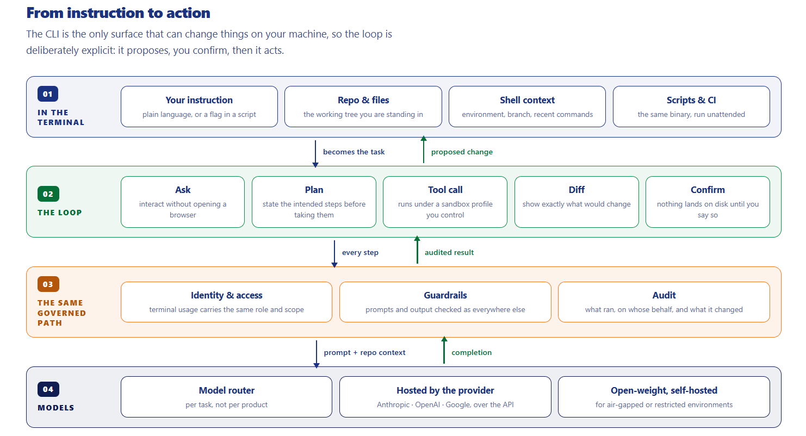
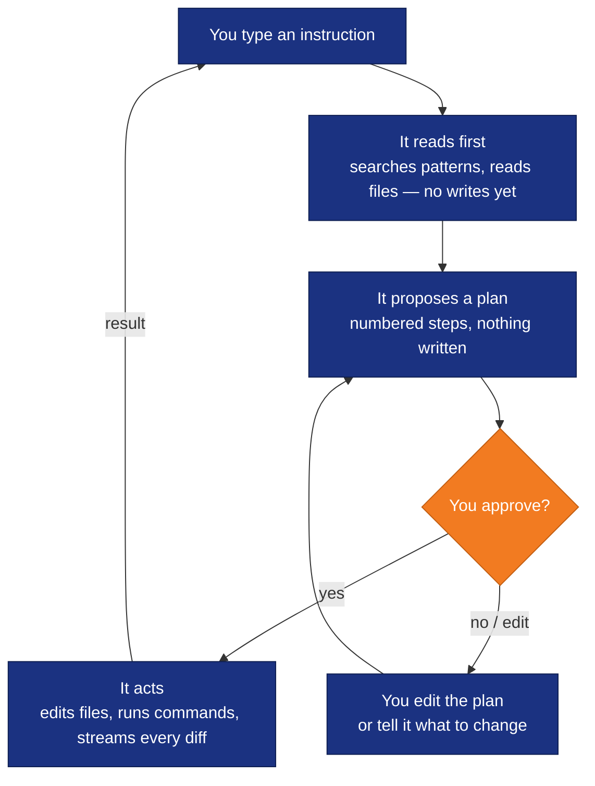

<div align="center">


<h1>AiNxt CLI</h1>

[](OSSMETADATA)
[](LICENSE)
[](CONTRIBUTING.md)
[](SECURITY.md)

**AiNxt CLI** is a terminal-based AI coding agent — a full-screen TUI that
understands your codebase, edits files, runs shell commands, searches the web,
and manages long-running tasks. Works with your own API key. No gateway required.

</div>

> **One Intelligence. Works for Everyone.**
>
> AiNxt brings intelligence into enterprise work, development environments,
> command-line workflows, and the foundations used to build new AI experiences.
> **This repository is AiNxt CLI** — AI in the terminal: ask, build, fix,
> automate, execute.
>
> An initiative of [NPCI](https://www.npci.org.in/) — National Payments Corporation of India.

<p align="center">
  
</p>
<p align="center">
  <sub>Four layers, read top-down: <b>in the terminal</b> (instruction · repo · shell · CI) →
  <b>the loop</b> (ask · plan · tool call · diff · confirm) →
  <b>the same governed path</b> (identity &amp; access · guardrails · audit) →
  <b>models</b> (router · hosted providers · open-weight self-hosted).
  The CLI is the only surface that can change things on your machine — so the loop is
  deliberately explicit: it proposes, you confirm, then it acts.</sub>
</p>

---

## Install

```sh
# macOS / Linux
curl -fsSL https://raw.githubusercontent.com/npci/ainxt-cli/main/install.sh | bash
```

<details><summary>Windows (PowerShell)</summary>

```powershell
irm https://raw.githubusercontent.com/npci/ainxt-cli/main/install.ps1 | iex
```

</details>

Puts `ainxt` on your `PATH` in minutes — no toolchain needed. Prefer to verify
first? Take the binary from the
[**Releases**](https://github.com/npci/ainxt-cli/releases/latest) page directly.

---

## Connect a model — then go

**You do not need an AiNxt gateway.** Three ways to connect a provider — pick one:

---

### ① TUI model picker — fastest, no file editing

Start `ainxt`, then open the model picker:

```
/model   or   Ctrl+M   →   + Add new model…
```

A guided form asks for the provider URL, your key, and picks the right protocol
for you. It writes the entry to `config.toml` automatically. Restart `ainxt`
once and the model appears in the picker.

---

### ② Environment variables — one-liner, nothing to edit

Set three vars and run. Nothing is written to disk.

**Anthropic**
```sh
export ANTHROPIC_API_KEY=sk-ant-...
export AINXT_API_BASE_URL=https://api.anthropic.com/v1
export AINXT_API_BACKEND=messages
ainxt -p "explain this repo"
```

**OpenAI**
```sh
export OPENAI_API_KEY=sk-...
export AINXT_API_BASE_URL=https://api.openai.com/v1
export AINXT_API_BACKEND=responses
ainxt -p "explain this repo"
```

**Ollama (local, no key)**
```sh
export AINXT_API_BASE_URL=http://localhost:11434/v1
export AINXT_API_KEY=local        # placeholder — Ollama ignores it
ainxt -p "explain this repo"
```

---

### ③ `~/.ainxt/config.toml` — named models, permanent

Define named models and switch between them with `-m <name>`.

**Anthropic / Claude**
```toml
[model.claude]
model          = "claude-sonnet-4-6"
base_url       = "https://api.anthropic.com/v1"
api_backend    = "messages"
context_window = 200000
env_key        = "ANTHROPIC_API_KEY"

[model.claude.extra_headers]
anthropic-version = "2023-06-01"
```
```sh
export ANTHROPIC_API_KEY=sk-ant-...
ainxt -m claude -p "explain this repo"
ainxt -m claude                          # full TUI
```

**OpenAI / GPT**
```toml
[model.gpt]
model       = "gpt-4o"
base_url    = "https://api.openai.com/v1"
api_backend = "responses"
env_key     = "OPENAI_API_KEY"
```
```sh
export OPENAI_API_KEY=sk-...
ainxt -m gpt
```

**Ollama (local, free, no key)**
```toml
[model.local]
model       = "llama3.2:latest"
base_url    = "http://localhost:11434/v1"
api_backend = "chat_completions"
```
```sh
export AINXT_API_KEY=local   # placeholder — Ollama needs no real key
ainxt -m local
```

> **`api_backend` quick reference:**
> - `messages` → Anthropic Messages API (Anthropic only)
> - `responses` → OpenAI Responses API (OpenAI's newer format)
> - `chat_completions` → OpenAI-compatible `/v1/chat/completions` — works with **any provider**: OpenAI (classic), Ollama, vLLM, LM Studio, Groq, Together AI, Mistral, Azure OpenAI, and any self-hosted or proxy endpoint

---

## Run

```sh
ainxt                          # full-screen TUI
ainxt -p "explain this repo"   # headless, one-shot
ainxt -m claude -p "fix this"  # specific model
ainxt -c                       # continue last session
```

---

## What it can do

| Capability | Detail | Docs |
|---|---|---|
| **Edits code** | Reads, writes and patches files behind a permission layer | [permissions & safety](crates/codegen/ainxt-pager/docs/user-guide/22-permissions-and-safety.md) · [sandbox](crates/codegen/ainxt-pager/docs/user-guide/18-sandbox.md) |
| **Runs commands** | Shell execution with approval rules and an optional sandbox | [permissions & safety](crates/codegen/ainxt-pager/docs/user-guide/22-permissions-and-safety.md) · [sandbox](crates/codegen/ainxt-pager/docs/user-guide/18-sandbox.md) |
| **Plans first** | Proposes an approach before touching anything — you approve | [plan mode](crates/codegen/ainxt-pager/docs/user-guide/19-plan-mode.md) |
| **Delegates** | Spawns subagents for parallel exploration and review | [subagents](crates/codegen/ainxt-pager/docs/user-guide/16-subagents.md) · [agent mode](crates/codegen/ainxt-pager/docs/user-guide/15-agent-mode.md) |
| **Extends** | MCP servers, skills, hooks and plugins | [MCP servers](crates/codegen/ainxt-pager/docs/user-guide/07-mcp-servers.md) · [skills](crates/codegen/ainxt-pager/docs/user-guide/08-skills.md) · [plugins](crates/codegen/ainxt-pager/docs/user-guide/09-plugins.md) · [hooks](crates/codegen/ainxt-pager/docs/user-guide/10-hooks.md) |
| **Remembers** | Sessions resume, fork and persist; project rules load automatically | [memory](crates/codegen/ainxt-pager/docs/user-guide/13-memory.md) · [sessions](crates/codegen/ainxt-pager/docs/user-guide/17-sessions.md) · [project rules](crates/codegen/ainxt-pager/docs/user-guide/12-project-rules.md) |
| **Scripts** | Headless mode with `plain`, `json` and `streaming-json` for CI | [headless / CI mode](crates/codegen/ainxt-pager/docs/user-guide/14-headless-mode.md) |
| **Drives editors** | Same agent over ACP — powers the IDE plugins | [AiNxt Code](https://github.com/npci/ainxt-code) |
| **Policy enforcement** | Every tool call passes through `ainxt-pep` — NPCI's built-in Policy Enforcement Point — before it runs | [permissions & safety](crates/codegen/ainxt-pager/docs/user-guide/22-permissions-and-safety.md) |

Full detail: [User Guide](crates/codegen/ainxt-pager/docs/user-guide/) — 24 chapters.

### Policy enforcement — built in by NPCI

Every action the agent takes passes through two security layers built into the
binary by NPCI, not bolted on after:

**`ainxt-policy` — the decision engine.** Holds a resolved `SecurityPolicy` and
answers per-action questions. Two invariants are unconditional:

- **Sovereign actions can never be auto-approved** — no flag, env var, YOLO mode,
  hook or settings source can bypass this. The check is structurally isolated from
  all configuration inputs.
- **Capability gate** — consequential actions below the `Workspace` trust tier are
  denied before they reach the model.

**`ainxt-pep` — the Policy Enforcement Point.** The single place a tool action is
authorised. Everything else in the stack describes or records; this is the one
that says no. Risk is charged *before* the verdict, so the action that trips a
budget is itself refused rather than being the last one allowed through.

**OSS vs managed builds.** The open-source binary ships with `require_policy =
false` — permissive defaults, no signed bundle required. A managed enterprise
build sets `require_policy = true` and embeds an Ed25519 authority public key;
the CLI refuses to start without a valid signed policy bundle from that authority.
This is the single field that separates the two postures — no code change, no
rebuild.

---

## How it works

**It proposes, you confirm, then it acts.** Plan mode is on by default — nothing
touches your working tree until you approve it.



`--always-approve` exists precisely *because* approval is the default, not the
exception.

---

## Contents

**Use it** — [Install](#install) · [Connect a model](#connect-a-model--then-go) · [Run](#run) · [What it can do](#what-it-can-do)

**Configure** — [All model providers](#all-model-providers) · [Configuration reference](#configuration) · [User guide](#user-guide)

**Build** — [Build from source](#build-from-source) · [Develop](#develop)

**Enterprise** — [AiNxt gateway](#enterprise--ainxt-gateway) · [Four products](#four-products-one-suite)

---

## All model providers

The CLI speaks three wire protocols. Pick the right `api_backend` and any
provider works:

| Provider | `api_backend` | Auth |
|---|---|---|
| Anthropic (Claude) | `messages` | `env_key` + `anthropic-version` header |
| OpenAI (GPT) | `responses` | `env_key = "OPENAI_API_KEY"` |
| Ollama (local) | `chat_completions` | `AINXT_API_KEY=local` placeholder |
| vLLM / LiteLLM / llama.cpp | `chat_completions` | `env_key` or `api_key` |
| Together AI / Groq / OpenRouter | `chat_completions` | `env_key` |

> **Not supported natively:** Azure OpenAI (needs `api-version` query param),
> AWS Bedrock (SigV4 auth), Google Vertex AI (service-account auth). Put an
> OpenAI-compatible proxy in front of those.

More examples — Together AI, capability overrides, sampling params:
[`docs/user-guide/11-custom-models.md`](crates/codegen/ainxt-pager/docs/user-guide/11-custom-models.md).

---

## Configuration

```
CLI flags  →  Environment variables  →  ~/.ainxt/config.toml  →  defaults
```

| File | Purpose |
|---|---|
| `~/.ainxt/config.toml` | Models, UI preferences, MCP servers, features |
| [`env.example`](env.example) | Every env var documented with defaults |

**Useful env vars:**

```sh
export AINXT_MAX_RETRIES=2          # retry budget (default 15 ≈ 6 min — set lower in CI)
export AINXT_ALLOW_INSECURE=1       # allow http:// endpoints (dev only)
export RUST_LOG=ainxt_shell=debug   # verbose logging
```

Full reference: [`env.example`](env.example) ·
[`docs/user-guide/05-configuration.md`](crates/codegen/ainxt-pager/docs/user-guide/05-configuration.md)

---

## Enterprise — AiNxt gateway

If your organisation runs [AiNxt Enterprise](https://github.com/npci/ainxt-enterprise),
point the CLI at it for governed access, shared budgets, audit and model
governance. This is **optional** — the CLI works standalone without it.

```sh
export AINXT_GATEWAY_URL=https://your-gateway.example.com
ainxt login          # saves token to ~/.ainxt/credentials.json
ainxt
```

> **Do not mix gateway and direct-provider config.** `AINXT_GATEWAY_URL` has
> `/ainxt/v1/api` appended automatically — pointing it at `api.anthropic.com`
> will 404 every call. Use `[model.*]` entries in `config.toml` for direct
> providers instead.

Organisation-specific env files (gateway URL, endpoints) are not in this repo —
`env.example` documents every variable so any organisation can produce its own.

---

## Build from source

Prefer to compile it yourself, or run an unreleased commit:

```sh
git clone https://github.com/npci/ainxt-cli.git
cd ainxt-cli
./setup.sh          # checks prereqs, offers to install them, builds ainxt
```

`./setup.sh --check` inspects prerequisites without changing anything.
`./setup.sh --release` builds the optimised binary.

**What you need:** Rust (auto-installed by setup.sh), `protoc` (DotSlash on
Unix, `winget install Google.Protobuf` on Windows), ~10 GB disk for `target/`.

```sh
# Or build directly once prereqs are in place:
cargo build -p ainxt-pager-bin --bin ainxt          # debug
cargo build --profile release-dist -p ainxt-pager-bin --bin ainxt   # release
./target/debug/ainxt --version
```

Full prerequisites detail: [§ Prerequisites](#prerequisites).

### Prerequisites

| Tool | Why | Check |
|---|---|---|
| **Rust** | Builds everything. Version pinned by `rust-toolchain.toml`, fetched automatically. | `cargo --version` |
| **protoc** | Compiles API definitions. Unix: DotSlash runs the hermetic pinned version. Windows: `winget install Google.Protobuf`. | `dotslash --help` or `protoc --version` |
| **Visual Studio Build Tools** *(Windows only)* | MSVC linker. `winget install Microsoft.VisualStudio.BuildTools` with the "Desktop development with C++" workload. | `rustc -vV` shows `host: ...-msvc` |
| **~10 GB disk** | `target/` after a debug build. | `df -h .` |

---

## Develop

```sh
# Check it compiles (fastest — no binary produced)
cargo check -p ainxt-pager-bin

# Run tests — no gateway or model needed, uses a built-in mock server
cargo test -p ainxt-sampler
cargo test --workspace          # all ~80 crates (slow)

# Lint and format
cargo clippy -p ainxt-pager-bin -- -D warnings
cargo fmt

# Build and run
cargo build -p ainxt-pager-bin --bin ainxt
./target/debug/ainxt
```

### Codebase map

| Path | What it is |
|---|---|
| `crates/codegen/ainxt-pager-bin/` | Entry point — `main.rs`, CLI args, startup |
| `crates/codegen/ainxt-pager/` | TUI — scrollback, prompt, modals, slash commands |
| `crates/codegen/ainxt-shell/` | Agent runtime — session loop, tool dispatch, auth |
| `crates/codegen/ainxt-sampler/` | LLM HTTP client — streaming, API backends, auth headers |
| `crates/codegen/ainxt-tools/` | Tool implementations — bash, file edit, grep, web fetch |
| `crates/codegen/ainxt-workspace/` | Filesystem — VCS, permissions, sandbox, checkpoints |
| `crates/codegen/ainxt-config/` | Config loading — config.toml, managed config |
| `crates/codegen/ainxt-env/` | Env constants — all env-overridable |
| `crates/codegen/ainxt-mcp/` | MCP — Model Context Protocol server integration |

| I want to change… | Look in |
|---|---|
| CLI flags | `crates/codegen/ainxt-pager/src/app/cli.rs` |
| A slash command | `crates/codegen/ainxt-pager/src/slash/commands/` |
| A built-in tool | `crates/codegen/ainxt-tools/src/implementations/` |
| Model API calls | `crates/codegen/ainxt-sampler/src/client.rs` |
| Auth / login | `crates/codegen/ainxt-shell/src/auth/` |

See [`CONTRIBUTING.md`](CONTRIBUTING.md) for PR process, DCO sign-off and code style.

---

## User guide

The full guide ships inside the binary and is readable as Markdown:

| Chapter | |
|---|---|
| [Getting started](crates/codegen/ainxt-pager/docs/user-guide/01-getting-started.md) | [Custom models](crates/codegen/ainxt-pager/docs/user-guide/11-custom-models.md) |
| [Keyboard shortcuts](crates/codegen/ainxt-pager/docs/user-guide/03-keyboard-shortcuts.md) | [Headless / CI mode](crates/codegen/ainxt-pager/docs/user-guide/14-headless-mode.md) |
| [Slash commands](crates/codegen/ainxt-pager/docs/user-guide/04-slash-commands.md) | [Agent mode](crates/codegen/ainxt-pager/docs/user-guide/15-agent-mode.md) |
| [Configuration](crates/codegen/ainxt-pager/docs/user-guide/05-configuration.md) | [Sandbox](crates/codegen/ainxt-pager/docs/user-guide/18-sandbox.md) |
| [MCP servers](crates/codegen/ainxt-pager/docs/user-guide/07-mcp-servers.md) | [Permissions & safety](crates/codegen/ainxt-pager/docs/user-guide/22-permissions-and-safety.md) |
| [Skills](crates/codegen/ainxt-pager/docs/user-guide/08-skills.md) | [Plan mode](crates/codegen/ainxt-pager/docs/user-guide/19-plan-mode.md) |

Also at the repo root: [`INSTALL.md`](INSTALL.md) · [`RUN.md`](RUN.md) ·
[`CONFIG.md`](CONFIG.md) · [`env.example`](env.example) · [`SECURITY.md`](SECURITY.md)

<details>
<summary>Upstream documentation (Grok Build fork)</summary>

AiNxt CLI is a fork of [Grok Build](https://github.com/xai-org/grok-build) by
SpaceXAI / xAI. Most behaviour is upstream behaviour, so upstream's docs are the
authoritative reference for anything AiNxt did not change:

| Resource | Use it for |
|---|---|
| [docs.x.ai/build/overview](https://docs.x.ai/build/overview) | Full online docs — concepts, tools, MCP, skills, sandboxing |
| [Upstream user guide](https://github.com/xai-org/grok-build/tree/main/crates/codegen/xai-grok-pager/docs/user-guide) | 27-chapter source this guide is derived from |
| [`26-config-reference.md`](https://github.com/xai-org/grok-build/blob/main/crates/codegen/xai-grok-pager/docs/user-guide/26-config-reference.md) | Exhaustive config reference (not carried into this fork) |

**Translate as you read:** upstream uses the `grok` binary with `XAI_*` / `GROK_*`
env vars and `~/.grok/`. Here it is `ainxt`, `AINXT_*`, and `~/.ainxt/`. Where
the two disagree on gateway, auth, model catalogue or TLS — this repo is correct.

</details>

---

## Four products, one suite

AiNxt is four products on a shared foundation. **This repository is AiNxt CLI.**

| | Product | What it provides |
|---|---|---|
| 01 | **[AiNxt Enterprise](https://github.com/npci/ainxt-enterprise)** | Governed enterprise AI — web, desktop, Office add-ins |
| 02 | **[AiNxt OS](https://github.com/npci/ainxt-os)** | Foundation for building AI applications and agents |
| 03 | **[AiNxt Code](https://github.com/npci/ainxt-code)** | AI inside the editor — complete, rewrite, explain, fix |
| 04 | **AiNxt CLI** ← *this repo* | AI in the terminal — ask, build, fix, automate, execute |

The CLI is **not** a satellite of Enterprise. It runs standalone. AiNxt Code
embeds this CLI as its agent engine.

---

## Cryptography

This software uses cryptography via standard open-source libraries. Laws on
import, possession, use and re-export of encryption software differ between
countries — check what applies where you are.

## License

First-party code: **Apache-2.0** — [`LICENSE`](LICENSE) · [`NOTICE`](NOTICE)
(fork attribution: derived from SpaceXAI "Grok Build", Apache-2.0).

Third-party: [`THIRD-PARTY-NOTICES`](THIRD-PARTY-NOTICES) ·
[`crates/codegen/ainxt-tools/THIRD_PARTY_NOTICES.md`](crates/codegen/ainxt-tools/THIRD_PARTY_NOTICES.md)

## Acknowledgments

This project is a fork of [Grok Build](https://github.com/xai-org/grok-build) by
**SpaceXAI**. This fork adds bearer-token sign-in against a self-hosted gateway,
a gateway-sourced model catalogue, and replaced default endpoints — full record in
[`NOTICE`](NOTICE) as Apache-2.0 §4(b) requires.

"Grok", "xAI" and "SpaceXAI" are trademarks of their respective owners. AiNxt
CLI is not affiliated with, endorsed by, or supported by xAI or SpaceXAI.

Also includes tool implementations from
[openai/codex](https://github.com/openai/codex) (Apache-2.0) — see
[`crates/codegen/ainxt-tools/THIRD_PARTY_NOTICES.md`](crates/codegen/ainxt-tools/THIRD_PARTY_NOTICES.md).

## Disclaimer

Licensed under the Apache License, Version 2.0.
<http://www.apache.org/licenses/LICENSE-2.0>

Distributed on an **"AS IS" BASIS, WITHOUT WARRANTIES OR CONDITIONS OF ANY
KIND** — see the licence for the specific language governing permissions and
limitations (§7 Disclaimer of Warranty, §8 Limitation of Liability).
